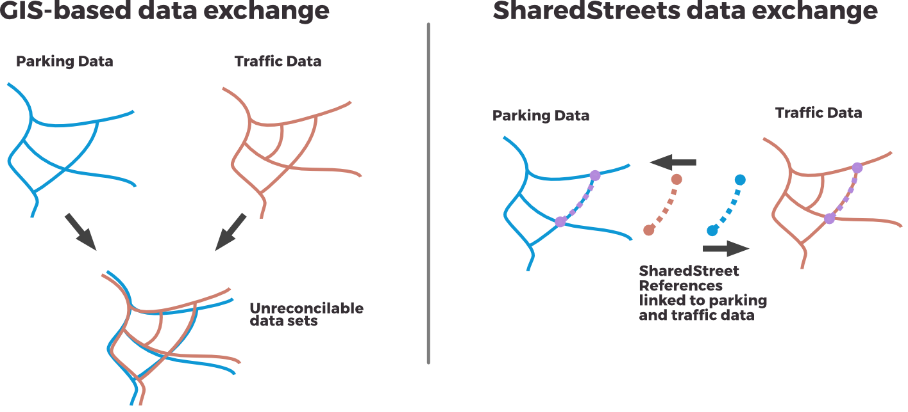
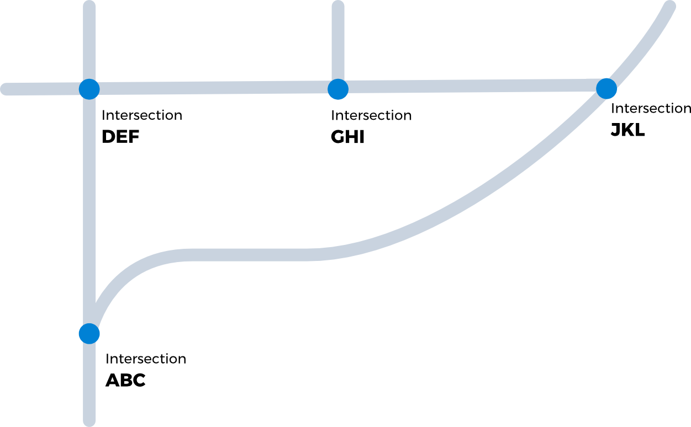
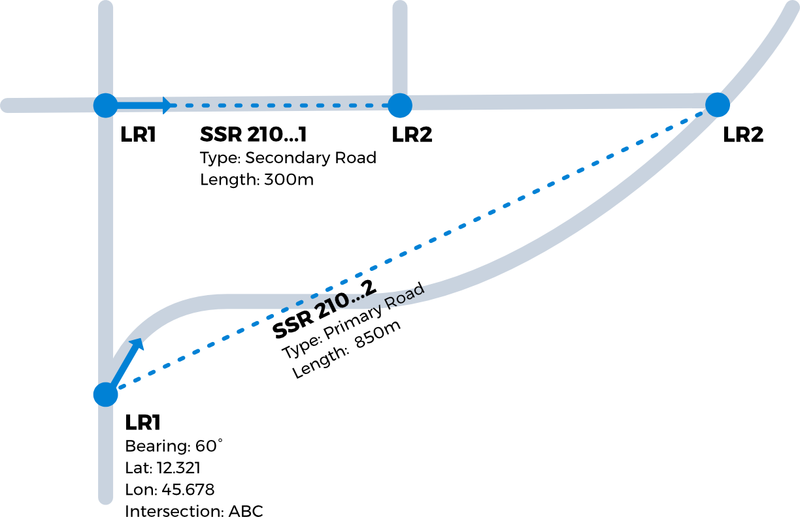
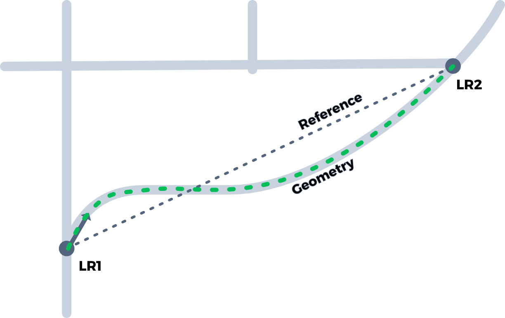
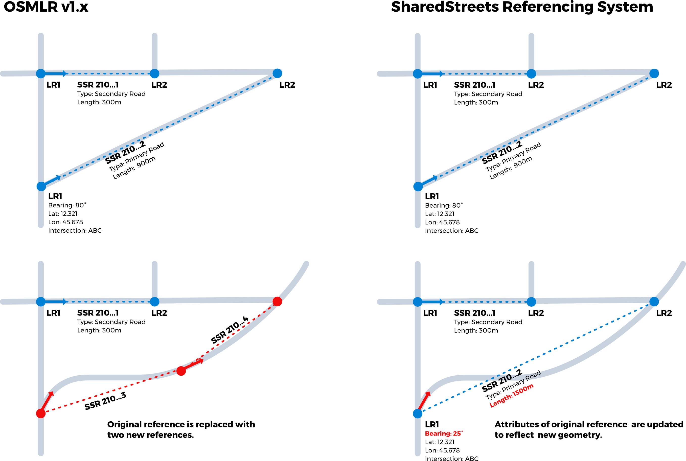

# SharedStreets Referencing System

## Introduction


SharedStreets data standards are a way to uniquely identify any street in world. SharedStreets makes maps connectable, and allows quick porting of data between different street representations, whether data linked to OpenStreetMap, or propreitary internal GIS or commerical basemaps.

Cities today depend on geographic information systems (GIS) to collect and share street data, but this process requires users to agree on a map, or to use predefined, and often proprietary IDs to describe streets.

This limits the potential for collaboration and data sharing between government agencies and with the private sector. And use of proprietary maps and identification systems can undermine cities’ ability to use and share critical information about public streets.

SharedStreets provides a global, non-proprietary system for describing streets, designed to incorporate any source of street-linked data. This allows public and private entities to communicate with clarity and precision about streets while ensuring full compatibility with organizations’ internal map data.





The SharedStreets referencing system was originally created as part of the [OpenTraffc project](https://github.com/opentraffic/architecture/issues/1), as a mechanism for sharing dynamic traffic information. SharedStreets builds on the core concepts from [OpenLR](http://www.openlr.info/) and provides a collection of data formats and open source tools to re-imagine collaboration and sharing of street-linked data.
 
The SharedStreets referencing system is being released as a DRAFT proposal, along with data samples and tools for generating references from OpenStreetMap and Shapefile data sources. Comments and suggestions on the format will be managed via this Github repository. Please open an Github issue or pull request to contribute. 

**A production version of the SharedStreets Referencing System and a global data set will be released soon. During the preview phase, referencing data can be generated using open source tools for any location.** 

### Example Applications
**Traffic data:** SharedStreets references are used to share basemap-independent descriptions of traffic conditions. In the OpenTraffic project fleet operators convert GPS data to to traffic observations (speeds along OpenStreetMap defined roadway segments). Traffic observations are shared externally using SharedStreets references to describe street segments.

**Street and curb inventory:** Cities produce detailed curb inventories (e.g. parking regulations and physical assets) using internally managed linear referencing systems (LRS), or latitude/longitude coordinates not linked with streets. Internal LRS data can be translated to SharedStreets references to allow interoperability with other city or external data sets.

**Incident/road closure reporting:** transport authorities share data about street conditions in real-time with consumer applications. SharedStreets references can be used to streamline reporting procedures by providing a shared, non-proprietary format for describing roadway incidents and closure events.

## Core Concepts

The SharedStreets Referencing system is built on four layers of data:

1. **SharedStreets References:** basemap-independent references for intersection to intersection street segments
2. **SharedStreets Intersection:** nodes connecting street street segments references
3. **SharedStreets Geometries:** geometries used to generate street segment references
4. **OSM Metadata:** underlying OSM way and node references used to construct SharedStreets data

### Segment references 

The OpenLR-style street segment references are the foundation of the SharedStreets Referencing System. These references allow users to uniquely describe any street segment in the world using just a few high-level characteristics. 

This allows users with different map geometries to describe the same street segments in identical or nearly identical terms. The references are used to find matching streets in users' existing internal maps. In cases where no matching street is found, users have the opportunity to update their map data to fill in missing or incorrectly mapped segments. 

Street segment references protect users' intellectual property, as data can be shared without disclosing a complete map. Segment references also enable rapid reconciliation of data derived from different maps.

### BYOM 
SharedStreets is based on the idea that users will maintain their own internal basemaps. Any basemap--open or proprietary--can generate SharedStreets references for sharing with others using a different map. With open basemap data users are encouraged to share the full set of SharedStreets data layers (references, geometries and metadata). Users with proprietary basemap data can share only the segment references, allowing exchange of information while protecting map street geometries and other intellectual property.

### Stable, non-proprietary shorthand IDs
SharedStreets uses 128-bit shorthand identifiers to relate data within the SharedStreets referencing system. These IDs provide a basemap-independent addressing system for street segment references, intersections and geometries. **These identifiers are generated deterministically using a hash of the underlying data.** This means that two different users with the same input data can generate matching SharedStreets identifiers. This simplifies data sharing, allowing users to match data using shorthand IDs whenever possible.

In the draft specification the 128-bit IDs are encoded as base-58 strings. 

### Generating references + data tiles
SharedStreets street references, intersections and geometries can be generated from OSM data using the [SharedStreets Builder](https://github.com/sharedstreets/sharedstreets-builder) application. 

As part of the DRAFT release pre-generated a sample of SharedStreets tiles for New York City are included in this repository. A zip archive of the full NYC tile set can be [downloaded here](https://www.dropbox.com/s/ys1wb25aipmkbi2/nyc_sample_data.zip?dl=0) (146MB file). Users can generate their own tiles for any arbitrary OSM data set using the SharedStreets Builder application. 

Once the data specification is finalized the SharedStreets program will generate and maintain a global data tile set, and provide tools to cities for reconciling their data with the referencing system. 

The DRAFT release of SharedStreets exports data as JSON files, cut into mercator tiles at zoom level 10. These DRAFT tiles are verbose and are designed to support exploration and refinement of the specification. Once the specificatio is finalized SharedStreets will provide JSON and Protocol Buffer tile formats. SharedStreets is also exploring use of "lossy" vector tile formats for distribution of data for web visualization. 


## DRAFT Data Formats


### SharedStreets Intersections




```javascript
{
	"type": "Feature",
	"properties": {
		"id": "5gRJyF2MT5BBErTyEesQLC",
		"osmNodeId": 42460951,
		"outboundSegmentIds": ["6mjqqv7YNsp4541DmrrRbV", "jwwKcUvHuCw6GJJAT3mDQ", "2Vw2XzW4cs7r32RLhQnqwA"],
		"inboundSegmentIds": ["VmSkhzGKoEc767w98x35La", "VXKSEokmvBJ81XHYhUronG", "B7RPzs3hb1cSXqYcAKmUhE"]
	},
	"geometry": {
		"type": "Point",
		"coordinates": [-74.003388, 40.634538]
	}
}
```

```javascript
{
	"type": "Feature",
	"properties": {
		"id": "N38a21UGykpnqxwez7NGS3",
		"osmNodeId": 42460956,
		"outboundSegmentIds": ["VXKSEokmvBJ81XHYhUronG", "KxeV6ycjnarJU8pGEmkUx9", "V6aRcYcZgd5D58GaEaxCaF"],
		"inboundSegmentIds": ["8ShvkUbHhu1SXzcE5XMj2L", "Ak3c8QdsYWVRn5Ap53hzcH", "2Vw2XzW4cs7r32RLhQnqwA"]
	},
	"geometry": {
		"type": "Point",
		"coordinates": [-74.004107, 40.63406]
	}
}
```

### SharedStreets References




SharedStreets References (SSR) are directional edges in a road network. Two-way streets have two SSRs, one for each direction of travel, while one-way streets only have one SSR. In the draft specification these are labeled "forward references" and "back references," with the forward reference following the direction of the map geometry used to generate the references.

Each SharedStreets Reference consists of two or more location references (LRs) that describe the latitude and longitude of the beginning or end of a street segment. SSRs also describe type of road (or the "form of way," as defined by OpenLR), and length of the geometry connecting location reference points. In combination these attributes uniquely describe any road segment, and can be used to look up corresponding streets in users’ internal maps.

#### Forward Reference

```javascript
{
	"id": "2Vw2XzW4cs7r32RLhQnqwA",
	"geometryId": "NxPFkg4CrzHeFhwV7Uiq7K",
	"formOfWay": 3,
	"locationReferences": [{
		"sequence": 1,
		"point": [-74.003388, 40.634538],
		"bearing": 228.890377,
		"distanceToNextRef": 80.730221,
		"intersectionId": "5gRJyF2MT5BBErTyEesQLC"
	}, {
		"sequence": 2,
		"point": [-74.004107, 40.63406],
		"intersectionId": "N38a21UGykpnqxwez7NGS3"
	}]
}
```

#### Back Reference

```javascript
{
	"id": "VXKSEokmvBJ81XHYhUronG",
	"geometryId": "NxPFkg4CrzHeFhwV7Uiq7K",
	"formOfWay": 3,
	"locationReferences": [{
		"sequence": 1,
		"point": [-74.004107, 40.63406],
		"bearing": 48.890138,
		"distanceToNextRef": 80.730221,
		"intersectionId": "N38a21UGykpnqxwez7NGS3"
	}, {
		"sequence": 2,
		"point": [-74.003388, 40.634538],
		"intersectionId": "5gRJyF2MT5BBErTyEesQLC"
	}]
}
```

*Notes:*

- For long segments LRs are repeated every 15km, segments shorter than 15km have only a beginning and end LR. 
- LRs describe the compass bearing of the street geometry for the 20 meters immediately following the LR. The final LR of a SSR does not provide a bearing. 
- An initial set of SSRs are built using OpenStreetMap (OSM) data, however, in the future SharedStreets users will be able to publicly register SSRs for streets not found in OSM. These could include data found in commercial or government maintained basemaps. Users do not have to share the underlying data, only the SSR descriptor. 


### SharedStreets Geometries




SharedStreets Geometries are street centerline data derived from the basemap used to produce SharedStreets References. A single geometry is shared by each set of forward and back references.

SharedStreets is premised on the idea that there's no one correct geometry for a given street. Just as street refereneces can be generated from any basemap, street geometries can be derived from any data source. 

```javascript
{
	"type": "Feature",
	"properties": {
		"id": "NxPFkg4CrzHeFhwV7Uiq7K",
		"startIntersectionId": "5gRJyF2MT5BBErTyEesQLC",
		"endIntersectionId": "N38a21UGykpnqxwez7NGS3",
		"forwardReferenceId": "2Vw2XzW4cs7r32RLhQnqwA",
		"backReferenceId": "VXKSEokmvBJ81XHYhUronG",
		"roadClass": 3
	},
	"geometry": {
		"type": "LineString",
		"coordinates": [
			[-74.003388, 40.634538],
			[-74.003621, 40.634383],
			[-74.003621, 40.634383],
			[-74.004107, 40.63406]
		]
	}
}
```


### SharedStreets OSM Metadata

SharedStreets generates metadata about the map data used to generate references and geometries. For OSM-derived references the way and nodes are stored as part of metadata layer. This simplifies matching references back to underlying basemap data, and provides a framework to easily track changes in the underlying basemap data.

```javascript
{
	"geometryId": "NxPFkg4CrzHeFhwV7Uiq7K",
	"waySections": [{
		"wayId": 420584810,
		"roadClass": 3,
		"oneWay": false,
		"roundabout": false,
		"link": false,
		"nodeIds": [42460951, 4205392123]
	}, {
		"wayId": 420584817,
		"roadClass": 3,
		"oneWay": false,
		"roundabout": false,
		"link": false,
		"nodeIds": [4205392123, 42460956]
	}]
}
```


### Frequently Asked Questions

#### How does this relate to OpenStreetMap? (Or, doesn't OSM already do this?)**

SharedStreets complements OpenStreetMap. OSM does not attempt to provide stable IDs, and complex OSM ways make many application challenging to build using raw OSM data. 

SharedStreets provides a layer of abstraction on top of OSM, allowing users to work with the *topology* of OpenStreetMaps data without dealing with the details how OSM ways are encoded. 

By providing direct references to OSM way and node IDs users can always query and relate the underlying OSM data in cases where needed. 

We believe that SharedStreets will allow users to more rapidly improve OpenStreetMap data by making it easier to identify missing streets, or opportunities to improve street geometries.  

#### How does SharedStreets relate to OSMLR v1.x?

OSMLR v1.x was developed to support OpenTraffic under contract from the World Bank. SharedStreets is effectively "OSMLR v2.0" but drops the OSMLR name as it intends to support broad range of map data formats including, but not limited to, SM.

SharedStreets also addresses two problems in the OSMLR v1.0 implementation:

**1) OSMLR v1.x segment references over 1km in length are unstable.**

The OSMLR v1.x implementation splits street segments into 1km sections. This design conflates location referencing (the identification of street segments) with linear reference (the identification of locations along segments).

As segment geometries change due to improved mapping, the length of segments changes, sometimes substantially. For longer segments this could create or destroy OSMLR references (e.g. a 10km stretch of road becomes 12km when the map is improved, resulting in two new OSMLR 1km segments). This undermines one the of the core ideas of OpenLR: underlying map geometries can change while segment references remain stable.




This problem is especially serious in developing countries where the quality of maps are rapidly improving. It also creates problems sharing data between users with different quality basemaps. Users with more precise maps will in most cases have longer street segments, resulting in new OSMLR segments that cannot be generated by users with coarser maps.

Pre-spliting segments into 1km sections also undermines applications that describe locations along segments (e.g curbside parking regulations) or features that span longer sections of road. Given the geometry changes may move (or even create or destroy) segment references, precise/stable linear referencing is not possible using OSMLR v1.x.

SharedStreets addresses this problem by decoupling location referencing and linear reference. All streets segments are mapped at intersection to intersection. Users with different quality maps should be able to overcome variations in geometry length by using other properties of the reference (segment end points, bearing, and "form of way") to match segements. SharedStreets provides a separate linear referencing format to describe points or sections of the segment.

**2) OSMLR shorthand IDs can't be repoduced without use of specialized softwware. This undermines OSMLR's value as a universal, non-proprietary standard.**

The OSMLR 1.x implementation depends on Valhalla routing enginge to generate segment IDs. These IDs cannot be generated without deploying the Valhalla system. This creates a dependency on a specific piece of software, likely reducing the value of the OSMLR spec by non-Valhalla users.

SharedStreets addresses this by creating a deterministic, software-independent process for generating shorthand IDs. SharedStreets provides open source software as a reference, but the methods can be easily incorporated into other applications to independently generate matching IDs.

The above issues noted, OSMLR v1.x can be mapped to SharedStreets segments when needed. SharedStreets segments cannot be accurately described using OSMLR v1.x due to limitations of the OSMLR v1.x spec.


