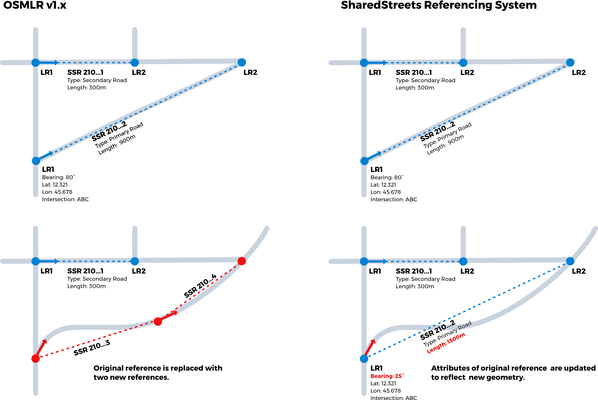

### OSMLR and SharedStreets

OSMLR v1.x was developed to support OpenTraffic under contract from the World Bank. SharedStreets is the continuation of this work as part of the Open Transport Partnership. The SharedStreets Referencing system is effectively "OSMLR v2.0" but drops the OSMLR name as it intends to support broad range of map data formats including, but not limited to, OpenStreetMap. 

SharedStreets also addresses two problems in the OSMLR v1.x implementation:

**1) OSMLR v1.x segment references over 1km in length are unstable.**

The OSMLR v1.x implementation splits street segments into 1km sections. This design conflates location referencing (the identification of street segments) with linear reference (the identification of locations along segments).

As segment geometries change due to improved mapping, the length of segments changes, sometimes substantially. For longer segments this could create or destroy OSMLR references (e.g. a 10km stretch of road becomes 12km when the map is improved, resulting in two new OSMLR 1km segments). This undermines one the of the core ideas of OpenLR: underlying map geometries can change while segment references remain stable.

This problem is especially serious in developing countries where the quality of maps are rapidly improving. It also creates problems sharing data between users with different quality basemaps. Users with more precise maps will in most cases have longer street segments, resulting in new OSMLR segments that cannot be generated by users with coarser maps.

Pre-spliting segments into 1km sections also undermines applications that describe locations along segments (e.g curbside parking regulations) or features that span longer sections of road. Given the geometry changes may move (or even create or destroy) segment references, precise/stable linear referencing is not possible using OSMLR v1.x.

SharedStreets addresses this problem by decoupling location referencing and linear reference. All streets segments are mapped at intersection to intersection. Users with different quality maps should be able to overcome variations in geometry length by using other properties of the reference (segment end points, bearing, and "form of way") to match segments. SharedStreets provides a separate linear referencing format to describe points or sections of the segment.

**2) OSMLR shorthand IDs can't be reproduced without use of specialized software. This undermines OSMLR's value as a universal, non-proprietary standard.**

The OSMLR 1.x implementation depends on Valhalla routing engine to generate segment IDs. These IDs cannot be generated without deploying the Valhalla system. This creates a dependency on a specific piece of software, likely reducing the value of the OSMLR spec by non-Valhalla users.

SharedStreets addresses this by creating a deterministic, software-independent process for generating shorthand IDs. SharedStreets provides open source software as a reference, but the methods can be easily incorporated into other applications to independently generate matching IDs.

The above issues noted, OSMLR v1.x can be mapped to SharedStreets segments when needed. SharedStreets segments cannot be accurately described using OSMLR v1.x due to limitations of the OSMLR v1.x spec.
